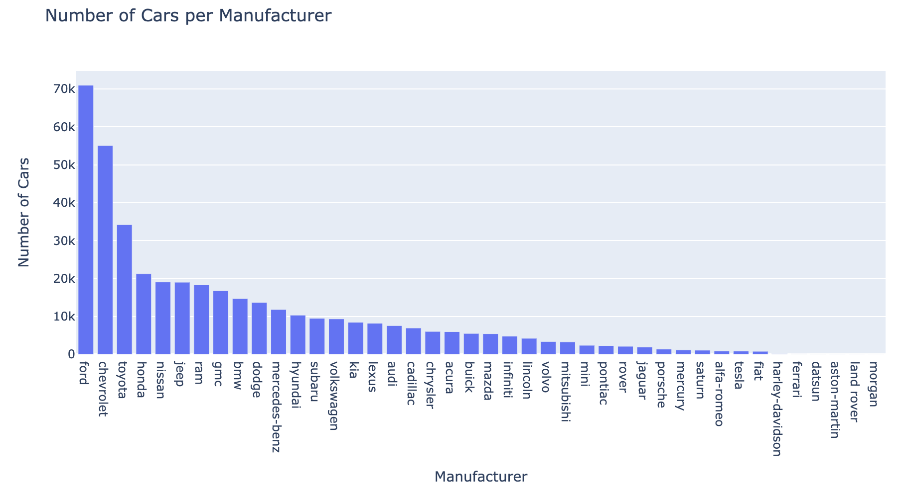
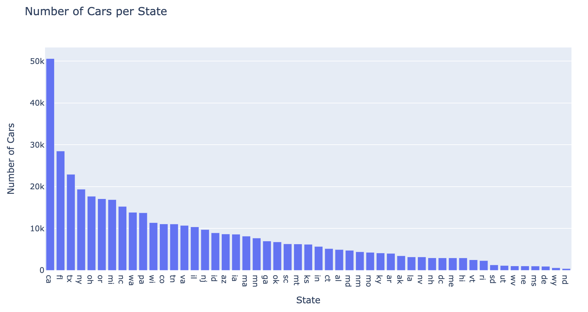
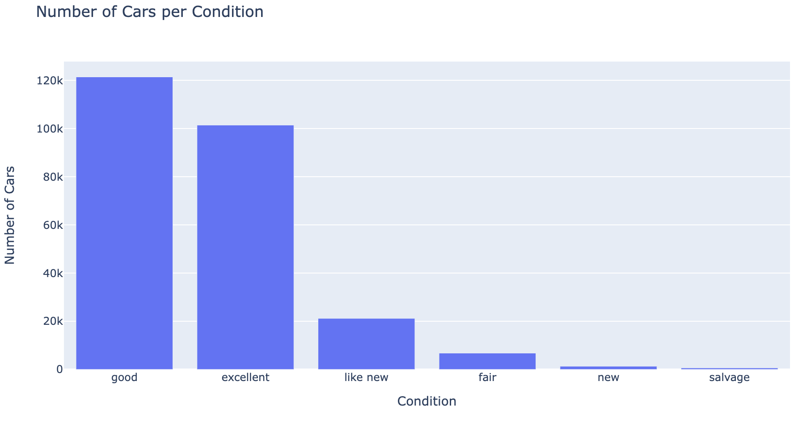
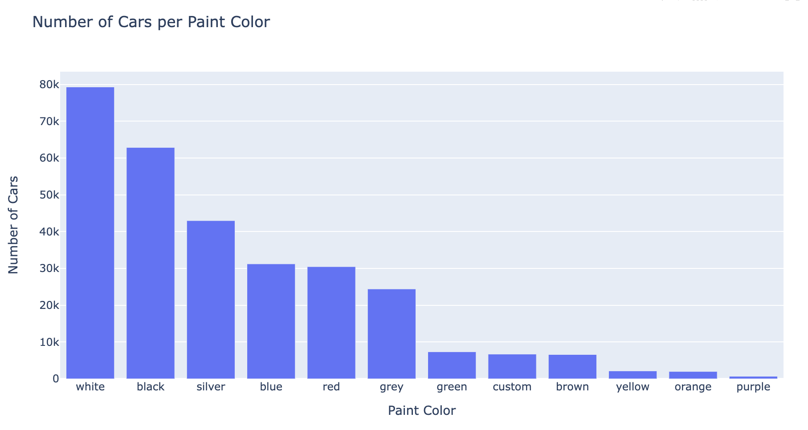
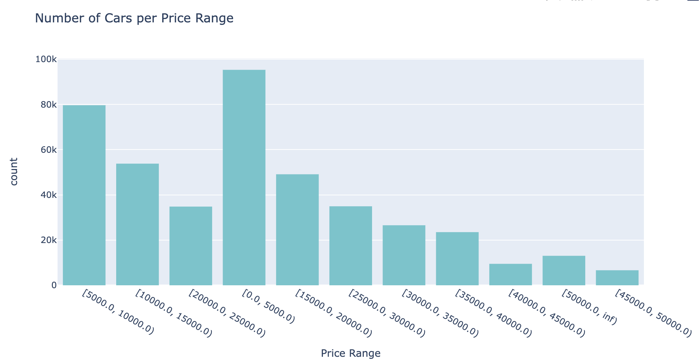
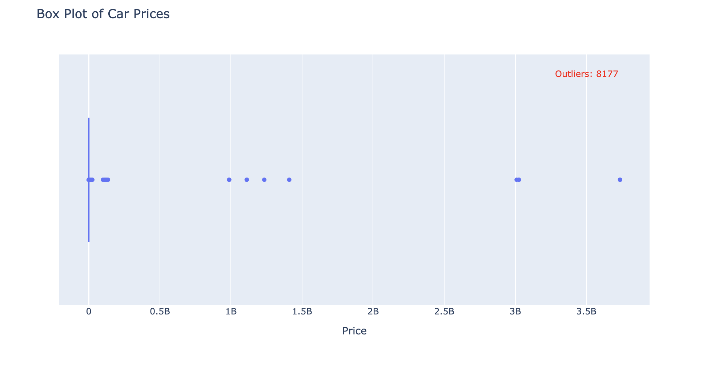
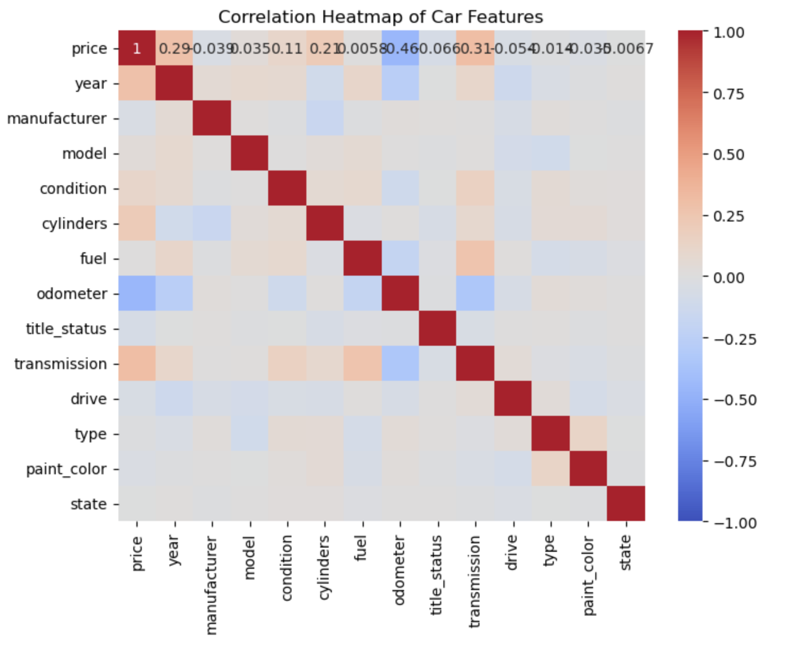

# Car Price Prediction

## Introduction
This project contains exploration of different models for predicting Car prices for data in here [Car Prices Data](data/vehicles.csv)

## Data Visualizations and clean up

**Data cleanup**

- Dropped the columns id, region, VIN, size apart from id other columns here have a lot of empty values.
- Dropped the rows with outliers for both price and odometer
- For the empty values, filled them up with a value that is occuring the max times other than odometer and year columns. For odometer used a mean value and for the year used a median value
- Converted the categorical values using labelencoder

## ModelSe

Ran different models after data cleanup Linear Regression, Linear Regression With PCA, Ridge Regression, Lasso Regression, Sequential Feature Selection with Lasso, RFE With Lasso, Polynomia regression, Polynomial regression is the one which has high score compared to the others

